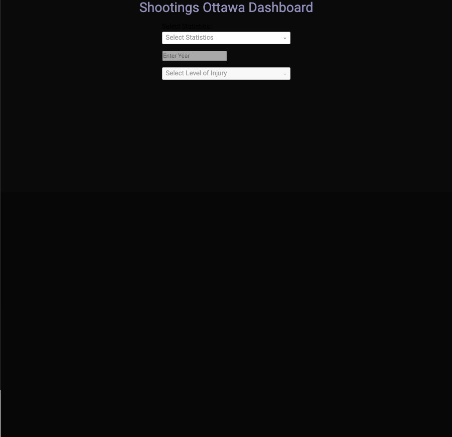
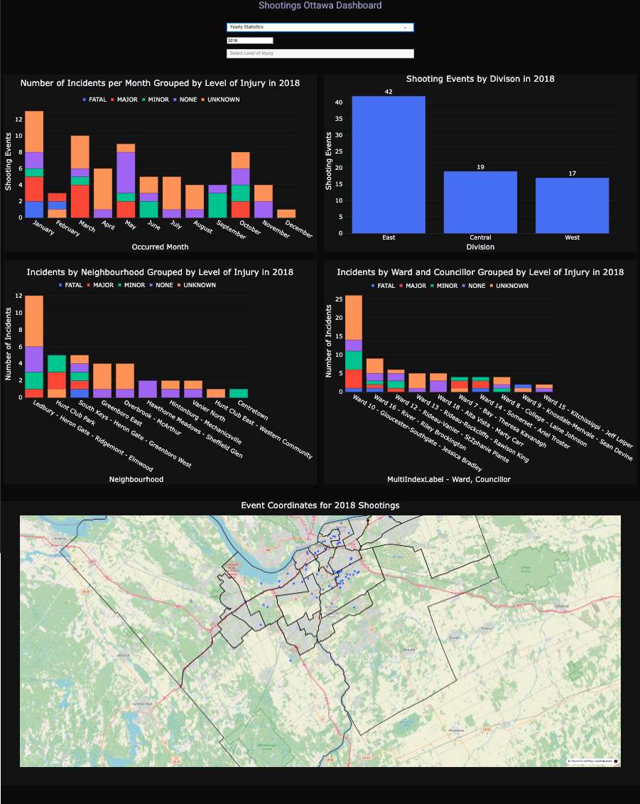
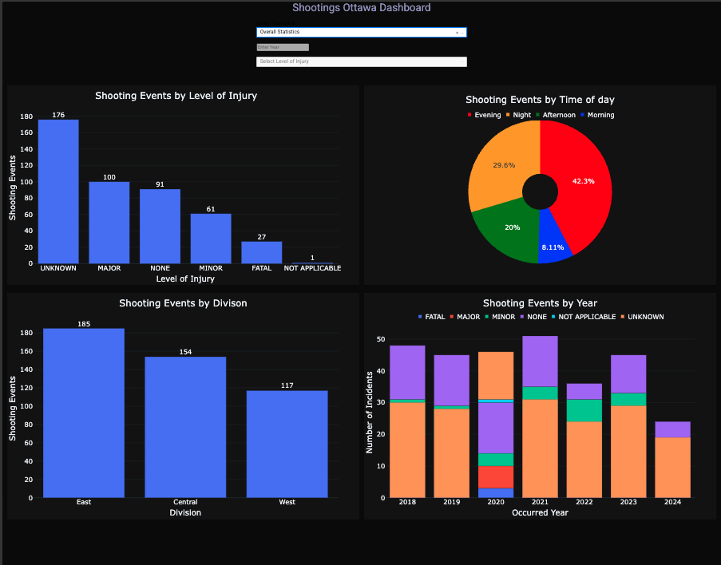
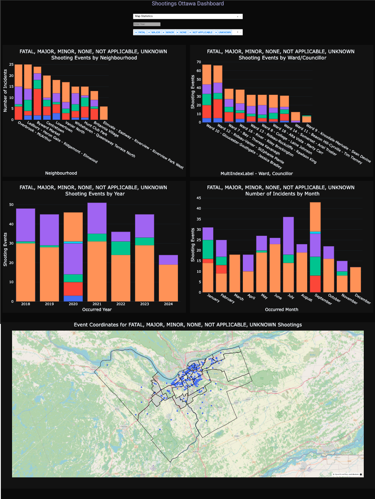

# Ottawa Shooting Incidents Dashboard (2018-2024)

An interactive data visualization dashboard built with **Python Dash** to explore and analyze **shooting incidents in Ottawa, Canada from 2018 to 2024**. This project provides dynamic insights into yearly shooting trends, injury severity levels, and neighbourhood-based statistics, enabling stakeholders to better understand patterns of violence across the city.

## Project Overview

The Ottawa Shootings Dashboard is designed to transform raw incident data into an interactive web application where users can:

- View **yearly shooting statistics** with filters for injury levels (Fatal, Major, Minor, etc.).
- Analyze shooting events across Ottawa **neighbourhoods**.
- Toggle between **yearly trend charts** and **geospatial map visualizations**.
- Dynamically filter data through **dropdown menus and input fields**.

This dashboard is aimed at supporting **law enforcement agencies, policymakers, researchers, and community organizations** by providing a clear, data-driven view of gun-related incidents in Ottawa.

---

## Features

- **Interactive Dropdown Filters** to select statistics (Yearly or Map based).
- **Input Field for Year Selection** to view data for specific years (2018-2024).
- **Dynamic Graph Layouts**: Bar charts, pie charts, and map visualizations adjust based on user selections.
- **Responsive Design** using Flexbox to ensure charts are well-aligned and accessible across screen sizes.
- **Callback Functions** that manage component interactivity and conditional input field enabling/disabling.

---

## Demo Video
[Video Demo of Application](https://www.loom.com/share/4442b59798a6445a952029ec913d4d2f)

---

## Technologies Used

- **Python**
  - Dash
  - Plotly Express
  - Pandas
  - MySQL Connector (for data retrieval)
- **MySQL**
  - Data aggregation and statistical queries
- **HTML/CSS** (inline Dash styling)
- **Jupyter Notebooks** (for data cleaning and exploratory analysis)

---

## File Structure

```
ottawa-shootings-dashboard
├── data/
│   └── shootingsottawa data (SQL Query)  # Cleaned shooting incidents dataset
├── assets/
│   └── custom_styles.css     # Optional external CSS for styling (if needed)
├── app.py                # Main Dash Application File
├── notebooks/
│   └── data_cleaning.ipynb   # Jupyter Notebook for data preparation
└── README.md
```

---

## Future Improvements

- Integrate a **live database connection** for real-time updates.
- Add **filterable map legends** and clustering for dense areas.
- Implement **user-driven report generation (PDF/CSV exports)**.
- Enhance **mobile responsiveness** for smaller screens.

---

## Acknowledgments

- Ottawa Police Service (for incident data)
- Open Data Ottawa Portal
- Plotly & Dash Documentation

---

## Screenshot






---

## 👤 Author
Olamide Olayinka
- 💼 [LinkedIn](https://www.linkedin.com/in/olamide-olayinka-a8222518/)
- 📊 [Portfolo](https://kodexl.github.io/olamideolayinka/)
- 📧 [Email](mailto:olamideolayinka@cmail.carleton.ca )
